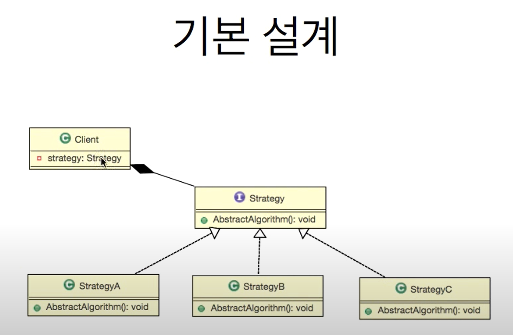

# 1. 전략패턴





```java
//전략 선언
public interface Strategy {
    
    // 기능 선언
    public void action();
}


//전략 구현체 1
public class StrategyImplOne implements Strategy {

    @Override
    public void action() {
        System.out.println("impl One");
    }
}


//전략 구현체 2
public class StrategyImplTwo implements Strategy {

    @Override
    public void action() {
        System.out.println("impl Two");
    }
}

// 주입받은 전략을 실제 실행
public class ActionObject {
    Strategy strategy;
    public ActionObject() {
        
    }
    
    public ActionObject(Strategy strategy) {
        setStrategy(strategy);
    }
    
    public void setStrategy(Strategy strategy) {
        this.strategy = strategy;
    }

    public void action() throws Exception{
        Optional<Strategy> op = Optional.ofNullable(strategy);
        op.orElseThrow(() -> new Exception("Ainterface not set Exception"));
        strategy.action();
    }
}


public class Strategy_Pattern_Main {
    public static void main(String[] args) throws Exception {
        ActionObject actionObject = new ActionObject();
        
        /** 필요에 따라 다른 전략을 주입 후 사용 */
        actionObject.setStrategy(new StrategyImplOne());
        actionObject.action();

        actionObject.setStrategy(new StrategyImplTwo());
        actionObject.action();;
    }
}
```