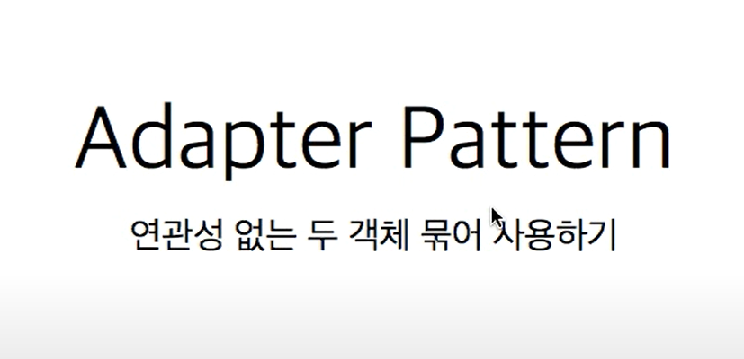
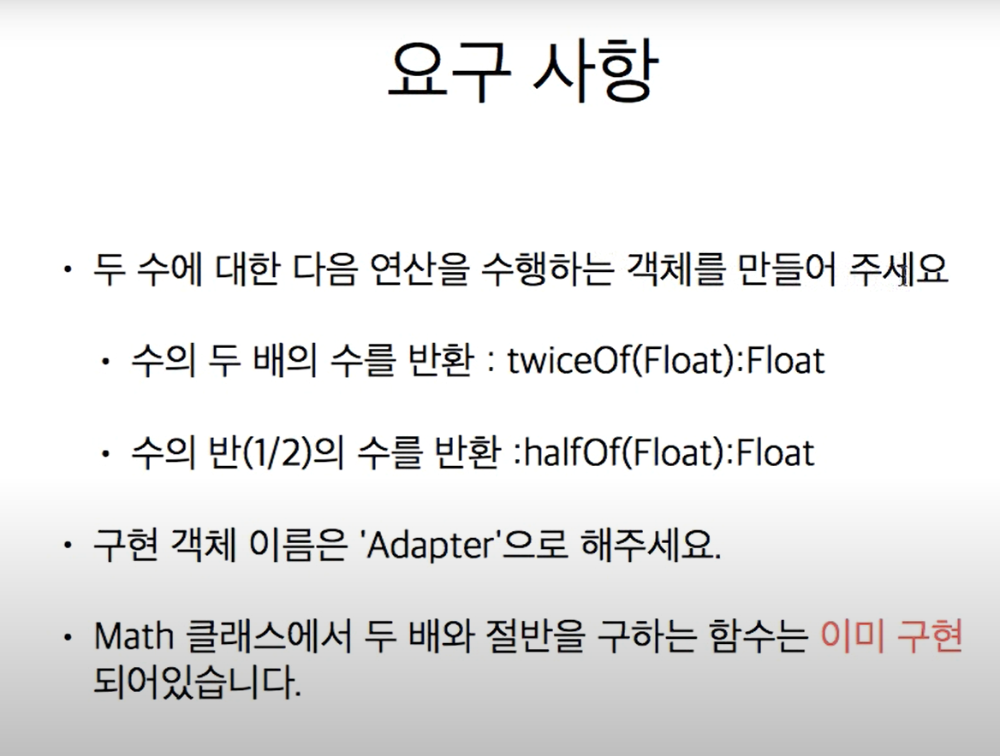

# 2. 어댑터 패턴




```java
//기존 Math 클래스
public class Math {
    public static double twoTime(double num) {
        return num * 2;
    }
    
    public static double half(double num) {
        return num / 2;
    }
    
    public static double doubled(Double d) {
        return d * 2;
    }
}


//어댑터 선언
public interface Adapter {
    Float twiceOf(Float f);
    Float halfOf(Float f);
}


//어댑터 구현체
public class AdapterImpl implements Adapter {

    @Override
    public Float twiceOf(Float f) {
        return (float)Math.twoTime(f.doubleValue());
    }

    @Override
    public Float halfOf(Float f) {
        return (float)Math.half(f.doubleValue());
    }

}


// 결과
public class Adapter_Pattern_Main {
    public static void main(String[] args) throws Exception {
        Adapter adapter = new AdapterImpl();
        System.out.println(adapter.twiceOf(20.0f));
        System.out.println(adapter.halfOf(40.0f));
    }
}

```