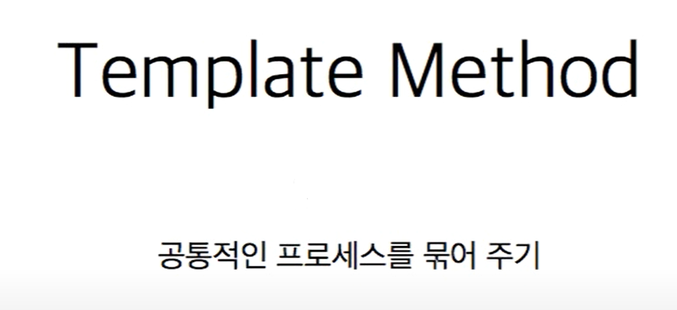
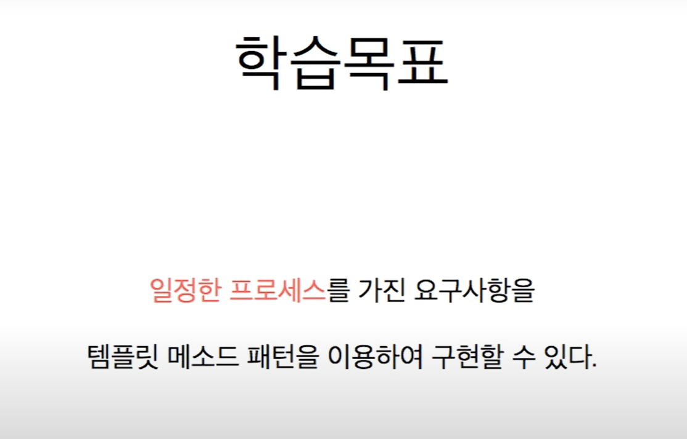
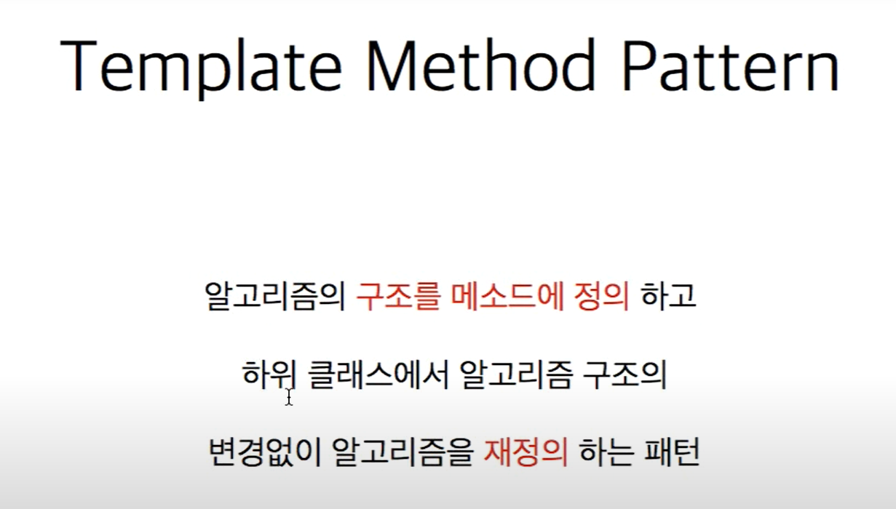
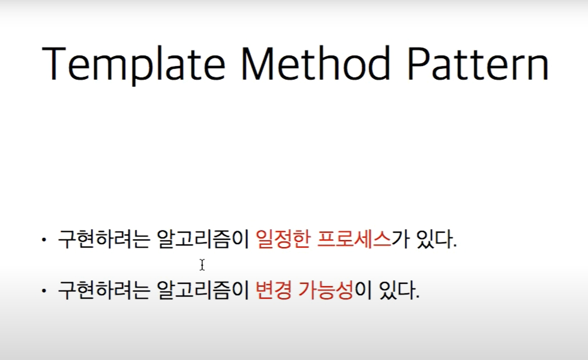
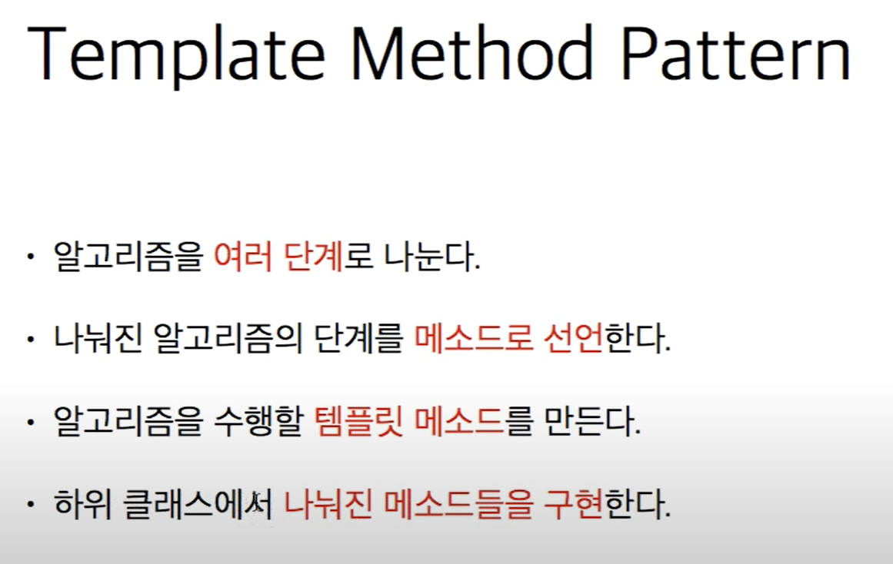
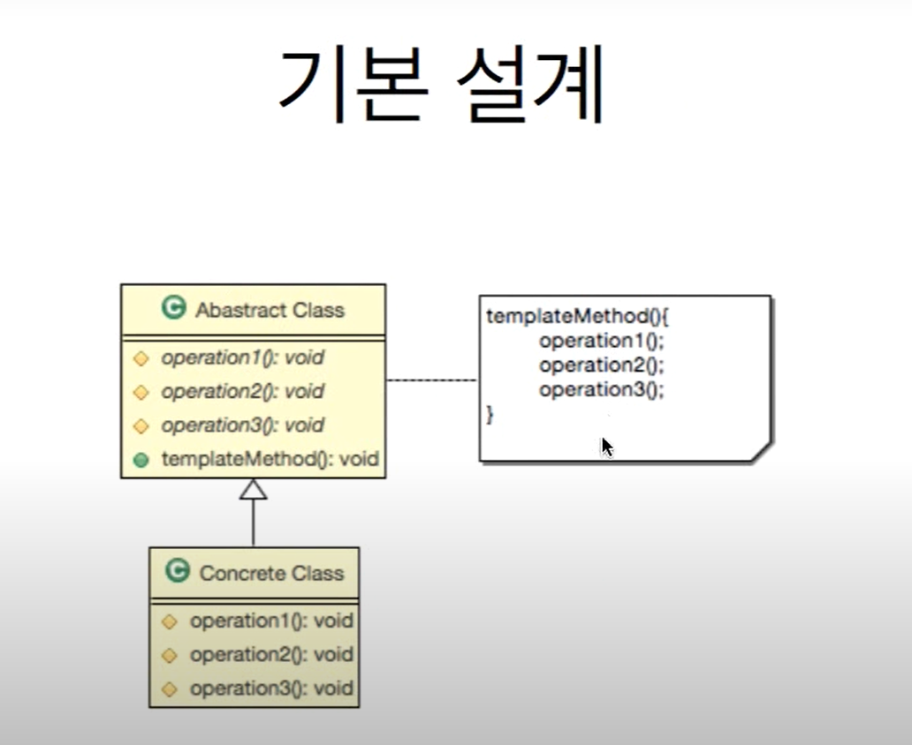

# 3. 템플릿 메소드 패턴









```java
//템플릿 추상 클래스 선언
public abstract class AbstractGameConnectHelper {
    
    /**
     * 각 프로세스를 담당하는 메소드들을 구현해야함
     */
    protected abstract String[] doSecurity(String string);
    protected abstract boolean authentication(String id, String password);
    protected abstract int authorization(String username);
    protected abstract String connection(String info);
    
    /**
     * 일정한 프로세스 실행하는 메소드
     */
    public String requestConnection(String encodedInfo) {
        String[] decodedInfo = doSecurity(encodedInfo);
        String id = decodedInfo[0];
        String password = decodedInfo[1];
        boolean valid = authentication(id, password);
        
        if (!valid) {
            throw new IllegalAccessError("not valid user info");
        }
        int auth = authorization(id);
        String authority = null;
        switch (auth) {
        case 0:
            authority = "ADMIN";
            break;
        case 1:
            authority = "USER";
            break;
        default:
            authority = "Unkown";
            break;
        }
        return connection(authority);
    }
}

// 템플릿 클래스 상속

public class DefaultGameConnectHelper extends AbstractGameConnectHelper {

    @Override
    protected String[] doSecurity(String string) {
        // 구현
        return null;
    }

    @Override
    protected boolean authentication(String id, String password) {
        // 구현
        return false;
    }

    @Override
    protected int authorization(String username) {
        // 구현
        return 0;
    }

    @Override
    protected String connection(String info) {
        // 구현
        return null;
    }
}


//메인
public class Template_Pattern_Main {
    public static void main(String[] args) throws Exception {
        AbstractGameConnectHelper helper = new DefaultGameConnectHelper();
        helper.requestConnection("Hello:World");
    }
}
```