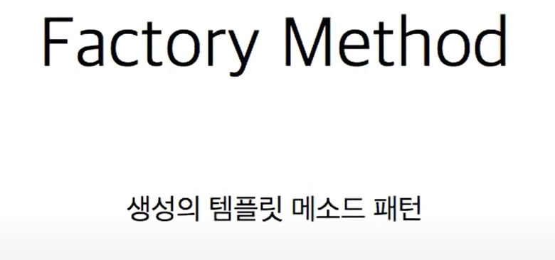
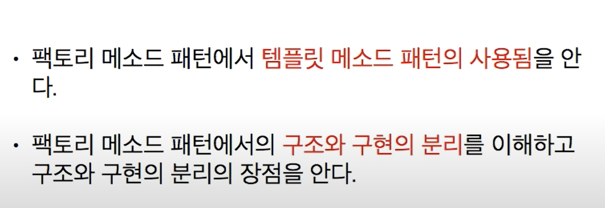
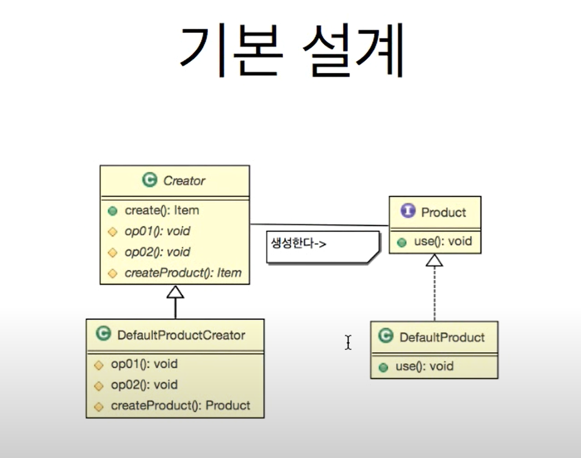

# 4. 팩토리 메서드 패턴





```java
//Product 인터페이스
public interface Product {
    public void use();
}

//Product 인터페이스 구현체
public class MpPotion implements Product {

    @Override
    public void use() {
        System.out.println("체력 회복");
    }
}

public class HpPotion implements Product {

    @Override
    public void use() {
        System.out.println("체력 회복");
    }
}

// Creator 클래스 선언
public abstract class ItemCreator {
    // create() 함수가 템플릿 메소드 패턴과 유사
    public Product create() {
        requestItemsInfo();
        Product item = createItem();
        createItemLog();
        return item;
    }
    
    // 아이템 생성전에 데이터 베이스에 아이템 정보 요청
    abstract protected void requestItemsInfo();
    // 아이템 생성 후 아이템 복제 등의 불법을 방지하기 위해 데이터베이스에 아이템 생성
    abstract protected void createItemLog();
    // 아이템 생성 알고리즘
    abstract protected Product createItem();
}

// Creator 클래스 구현체
public class MpCreator extends ItemCreator {

    @Override
    protected void requestItemsInfo() {
        System.out.println("데이터베이스에서 마나 회복 물약의 정보를 가져옴");
    }

    @Override
    protected void createItemLog() {
        System.out.println("데이터베이스에서 마나 회복 물약 생성");
    }

    @Override
    protected Product createItem() {
        return new MpPotion();
    }

}

public class HpCreator extends ItemCreator {

    @Override
    protected void requestItemsInfo() {
       System.out.println("데이터베이스에서 회복 물약의 정보를 가져옴");

    }

    @Override
    protected void createItemLog() {
        System.out.println( "회복 물약을 새로 생성했습니다.");
    }

    @Override
    protected Product createItem() {
        return new HpPotion();
    }
}


//메인
public class Factory_Method_Pattern_Main {

    public static void main(String[] args) {
        ItemCreator creator = new HpCreator();
        Product item = creator.create();
        item.use();
        
        creator = new MpCreator();
        item = creator.create();
        item.use();
    }

}
```
