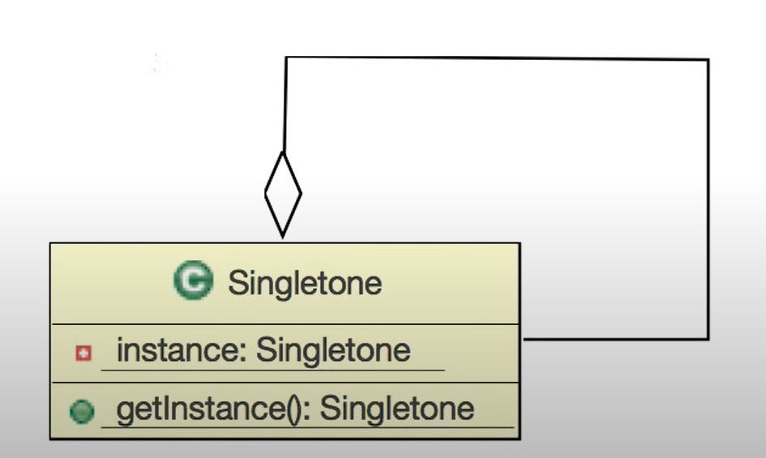

# 5. 싱글톤 패턴

하나의 인스턴스만 생성하는 패턴



## 1. 기본 싱글톤 패턴

멀티 스레드 환경에서 안전하지 않은 패턴 인스턴스가 생성되었는지 여부를 체크하는 조건문이 동시에 두번   
호출 될 수 있기 때문에 하나의 인스턴스가 아닌 여러개의 인스턴스가 발생할 위험이 있다.

```java
public class SystemSpeaker {
    private static SystemSpeaker instance;
    private int volume;
    
    private SystemSpeaker() {
        volume = 5;
    }
    
    public static SystemSpeaker getInstance() {
        if (instance == null) {
            instance = new SystemSpeaker();
        }
        return instance;
    }

    public int getVolume() {
        return volume;
    }

    public void setVolume(int volume) {
        this.volume = volume;
    }
}

```

## 2. 더블 체크 락킹 싱글톤 패턴

1번의 약점을 개선하여 첫 부분에서 객체를 만들어야 하는지를 먼저 확인하고 객체를 만들어야 할때만 락을 얻어야 하도록  
할 수있다. ** 중요한 점은 하나의 인스턴스를 참조하는 변수는 volatile로 선언되어야 한다**  
이렇게 함으로서 캐쉬 불일치 문제를 해결할 수 있다.
```java
public class DoubleCheckedLockingSingleton {

    //더블 체크 락킹에서 volatile은 필수
    private volatile static DoubleCheckedLockingSingleton instance;
    
    private DoubleCheckedLockingSingleton() {}
    
    public static DoubleCheckedLockingSingleton getInstance() {
        
        if (instance == null) {
            synchronized (DoubleCheckedLockingSingleton.class) {
                if (instance == null) {
                    instance = new DoubleCheckedLockingSingleton();
                }
            }
        }
        return instance;
    }
}
```

## 3. 레이지로딩 싱글톤 패턴
클래스 초기화는 그 메소드들이나 필드들 중 하나에 접근하는 첫 순간에 일어나기 때문에, 늦은 초기화(lazy initialization)  을 구현하기 위해서 중첩 스태틱 클래스를 이용할 수 있다.
  
이방법은 Initialization-on-demand holder 개념을 이용한 것이다.  
private static class는 JVM의 static initializer에 의해서 초기화 되고 메모리로 올라가게 된다.  
최초로 ClassLoader에 의해 load 될 때 loadClass 메서드를 통해 올라가게 된다.  
이 때 내부로 synchronized가 실행된다.  
따라서 명시적으로 synchronized를 이용하지 않고도 동일한 효과를 낼 수 있다.
```java
public class LazyLoadingSystemSpeaker {
    private int volume;
    
    private LazyLoadingSystemSpeaker() {
        volume = 5;
    }
    
    private static class LazyHolder {
        public static LazyLoadingSystemSpeaker instance = new LazyLoadingSystemSpeaker();
    }
    
    public static LazyLoadingSystemSpeaker getInstance() {
        return LazyHolder.instance;
    }

    public int getVolume() {
        return volume;
    }

    public void setVolume(int volume) {
        this.volume = volume;
    }
}
```