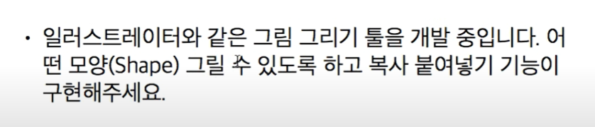

# 6. 프로토 타입패턴

프로토 타입 패턴을 이용하여 복잡한 인스턴스를 복사할 수 있다.  

## 주로 사용되는 경우
종류가 많아서 클래스로 정리되지 않는 경우  
클래스로부터 인스턴스 생성이 어려운 경우  

## 요구사항

 

 ## 구현 방법
 `Cloneable` 인터페이스를 구현한다. 
 가장 상위 Object 클래스로 부터 clone()을 오버라이드한다.
 ```java

//1. 번째
@Override
protected Object clone() throws CloneNotSupportedException {
    return super.clone();
}


//2. 복사할 객체를 타입캐스팅을 통하여 반환할 수도 있다.
@Override
protected Point clone() throws CloneNotSupportedException {
    return (Point)super.clone();
}
```

멤버변수를 복사할 경우 primitive나 Immutable 타입이 아닌 경우 Shallow copy가 되지 때문에  
이런 타입들도 전부  `Cloneable` 인터페이스를 구현하고 가장 상위 Object 클래스로 부터 clone()을 오버라이드 하거나,  
```java
@Override
protected Circle clone() throws CloneNotSupportedException {
    Circle circle = (Circle)super.clone();
    Point point = (Point)this.point.clone();
    circle.setPoint(point);
    return circle;
}
```

## 구현
```java

public class Circle implements Cloneable {
    private Point point;
    private int r;
    

    /**
     * deep copy
     */
    @Override
    protected Circle clone() throws CloneNotSupportedException {
        Circle circle = (Circle)super.clone();
        Point point = (Point)this.point.clone();
        circle.setPoint(point);
        return circle;
    }
    
    public Circle(int x, int y, int r) {
        this.point = new Point(x, y);
        this.r = r;
    }

    public Point getPoint() {
        return point;
    }

    public void setPoint(Point point) {
        this.point = point;
    }

    public int getR() {
        return r;
    }

    public void setR(int r) {
        this.r = r;
    }
}


public class Point implements Cloneable {
    private int x, y;

    public Point(int x, int y) {
        this.x = x;
        this.y = y;
    }
    
    public int getX() {
        return x;
    }

    public void setX(int x) {
        this.x = x;
    }

    public int getY() {
        return y;
    }

    public void setY(int y) {
        this.y = y;
    }

    @Override
    protected Point clone() throws CloneNotSupportedException {
        return (Point)super.clone();
    }
}

public class Shape implements Cloneable {
    
    private String id;

    public String getId() {
        return id;
    }

    public void setId(String id) {
        this.id = id;
    }
    
    @Override
    protected Object clone() throws CloneNotSupportedException {
        return super.clone();
    }

}

//메인
public class ProtoType_Pattern_Main {

    public static void main(String[] args) throws Exception {
        Circle circle1 = new Circle(1, 1, 3);
        Circle circle2 = circle1.clone();
        
        System.out.println(circle1.getPoint().getX() +
                ":" +circle1.getPoint().getY() + 
                ":" +circle1.getR());
        
        System.out.println(circle2.getPoint().getX() +
                ":" +circle2.getPoint().getY() + 
                ":" +circle2.getR());
        
        /**
         * deep copy test
         */
        circle1.getPoint().setX(3);
        circle1.getPoint().setY(2);

        System.out.println(circle1.getPoint().getX() +
                ":" +circle1.getPoint().getY() + 
                ":" +circle1.getR());
        
        System.out.println(circle2.getPoint().getX() +
                ":" +circle2.getPoint().getY() + 
                ":" +circle2.getR());
        
        /**
         * result
         * 1:1:3
           1:1:3
           3:2:3
           1:1:3
         */
    }
}
```
