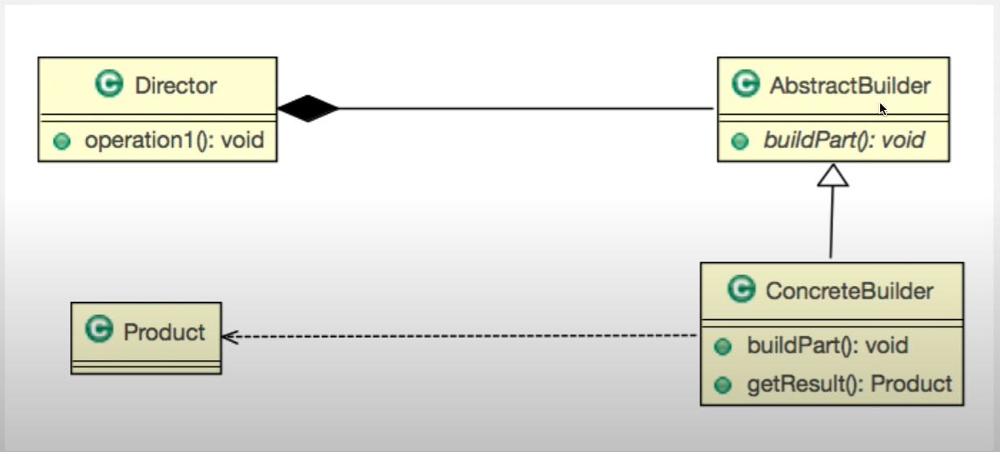

# 7. 빌더패턴 - 1

복잡한 단계가 필요한 인스턴스 생성을 빌더 패턴을 통해서 구현할 수 있다.  
  
복잡한 단계를 거쳐야 생성되는 객체의 구현을 서브 클래스에게 넘겨주는 패턴  

 


## 구현
```java

// 설정해야 할 값이 많은 Computer 클래스
public class Computer {
    private String cpu;
    private String ram;
    private String storage;
    
    public Computer(String cpu, String ram, String storage) {
       this.cpu = cpu;
       this.ram = ram;
       this.storage = storage;
    }
    public String getCpu() {
        return cpu;
    }
    public void setCpu(String cpu) {
        this.cpu = cpu;
    }
    public String getRam() {
        return ram;
    }
    public void setRam(String ram) {
        this.ram = ram;
    }
    public String getStorage() {
        return storage;
    }
    public void setStorage(String storage) {
        this.storage = storage;
    }
    
    @Override
    public String toString() {
        return "Computer [cpu=" + cpu + ", ram=" + ram + ", storage=" + storage + "]";
    }
}

// BluePrint 인터페이스 생성 - AbstractBuilder
public abstract class BluePrint {
    abstract public void setCpu();
    abstract public void setRam();
    abstract public void setStorage();
    abstract public Computer getComputer();
}

// BludePrint 인터페이스를 구현해서 LG그램 클래스를 만든다. - ConcreteBuilder
public class LgGramBluePrint extends BluePrint {
    private Computer computer;
    public LgGramBluePrint() {
        computer = new Computer("default", "default", "default");
    }
    @Override
    public void setCpu() {
      computer.setCpu("intel");
    }

    @Override
    public void setRam() {
       computer.setRam("16G");
    }

    @Override
    public void setStorage() {
      computer.setStorage("256G");
    }
    
    @Override
    public Computer getComputer() {
        return computer;
    }
}

// BluePrint를 주입받아서 Computer를 생성하는 빌더 - Director
public class ComputerBuilder {
    private BluePrint print;

    public void setPrint(BluePrint print) {
        this.print = print;
    }
    
    public void build() {
        print.setCpu();
        print.setCpu();
        print.setStorage();
    }
    
    public Computer getComputer() {
        return print.getComputer();
    }
}

// 메인
public class Builder_Pattern_Main {
    public static void main(String[] args) {
        ComputerBuilder builder = new ComputerBuilder();
        builder.setPrint(new LgGramBluePrint());
        builder.build();
        Computer computer = builder.getComputer();
        System.out.println(computer);
    }
}

```