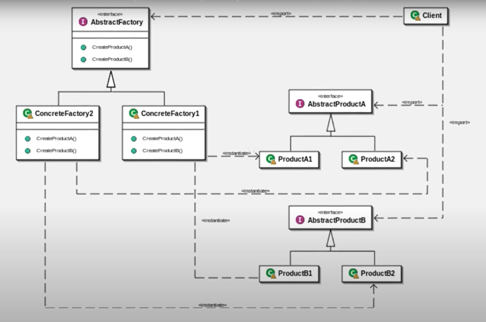

# 9. 추상 팩토리 패턴 - 1

관련 있는 객체의 생성을 가상화 할 수 있다.  
  
그림을 보면 AbstractA와 AbstractB는 서로 관련이 있는 것을 확인 할 수 있다  



## 구현
```java

// 자전거 몸체
public interface Body {

}

// 자전거 바퀴
public interface Wheel {
    
}

// 자전거 몸체를 구현한 삼천리 자전거 클래스
public class SamBody implements Body {

}

// 자전거 바퀴를 구현한 삼천리 자전거 바퀴
public class SamWheel implements Wheel {

}

// 부품 생성하는 공장의 추상화
public interface BikeFactory {
    public Body createBody();
    public Wheel createWheel();
}

// 삼천리 자전거 공장

public class SamFactory implements BikeFactory {
    @Override
    public Body createBody() {
        return new SamBody();
    }

    @Override
    public Wheel createWheel() {
        return new SamWheel();
    }
}

// 메인
public class Abstract_Factory_Pattern {
    public static void main(String[] args) {
        BikeFactory factory = new SamFactory();
        Body body = factory.createBody();
        Wheel wheel = factory.createWheel();
        
        System.out.println(body.getClass());
        System.out.println(wheel.getClass());
    }
}
```