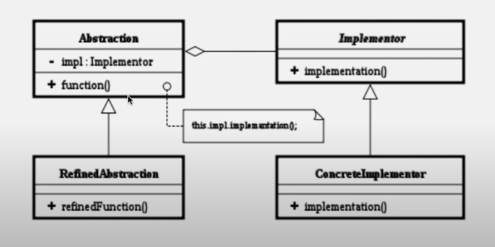
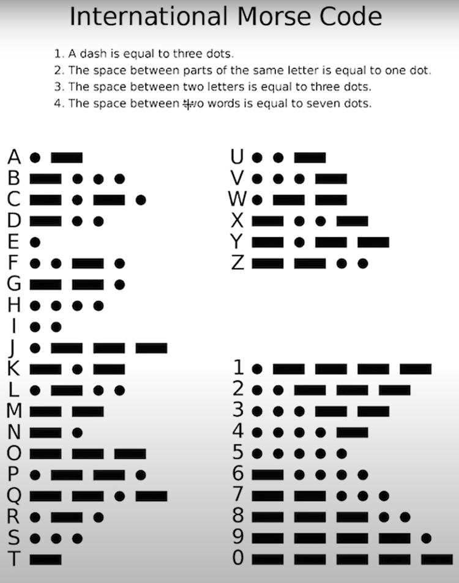

# 11. 브릿지 패턴

기능 계층과 구현 계층의 분리  
  
어댑터 패턴과 브릿지 패턴을 연결하여 이해  




## 구현

```java

//모스 부호 기능 인터페이스 - Implementor
public interface MorseCodeFunction {
    public void dot();
    public void dash();
    public void space();
}

//모스 부호 구현체 - 1  ConcreteImplementor
public class DefaultMCP implements MorseCodeFunction {

    @Override
    public void dot() {
        System.out.print(".");

    }

    @Override
    public void dash() {
        System.out.print("-");

    }

    @Override
    public void space() {
        System.out.print(" ");
    }

}

// 모스 부호 구현체 - 2 ConcreteImplementor
public class SoundMCP implements MorseCodeFunction {

    @Override
    public void dot() {
        System.out.print("삐");
    }

    @Override
    public void dash() {
        System.out.print("삣");
    }

    @Override
    public void space() {
        System.out.print("뿅");
    }
}

 
// 모스코드 구현체의 델리케이터 클래스인 MorseCode - Abstraction
public class MorseCode {
    private MorseCodeFunction function;
    protected MorseCode(MorseCodeFunction function) {
        this.function = function;
    }
    
    protected void dot() {
        function.dot();
    }
    
    protected void dash() {
        function.dash();
    }
    
    protected void space() {
        function.space();
    }
}

// MorseCode를 상속한 클래스 - RefinedAbstraction
public class PrintMorseCode extends MorseCode {

    public PrintMorseCode(MorseCodeFunction function) {
        super(function);
    }

    public PrintMorseCode g() {
        dash();
        dash();
        dot();
        space();
        return this;
    }

    public PrintMorseCode a() {
        dot();
        dash();
        space();
        return this;
    }

    public PrintMorseCode r() {
       dot();
       dash();
       dot();
       space();
       return this;
    }
    
    public PrintMorseCode m() {
        dash();
        dash();
        space();
        return this;
    }
}


//메인
public class Bridge_Pattern_Main {

    /**
     * 기능과 구현의 분리
     */
    public static void main(String[] args) {
        PrintMorseCode pmc = new PrintMorseCode(new DefaultMCP());
        pmc.a().g().m().r();
        
        System.out.println();
        
        pmc = new PrintMorseCode(new SoundMCP());
        pmc.a().g().m().r();
    }

}
```

## 결과
```console
.- --. -- .-. 
삐삣뿅삣삣삐뿅삣삣뿅삐삣삐뿅
```