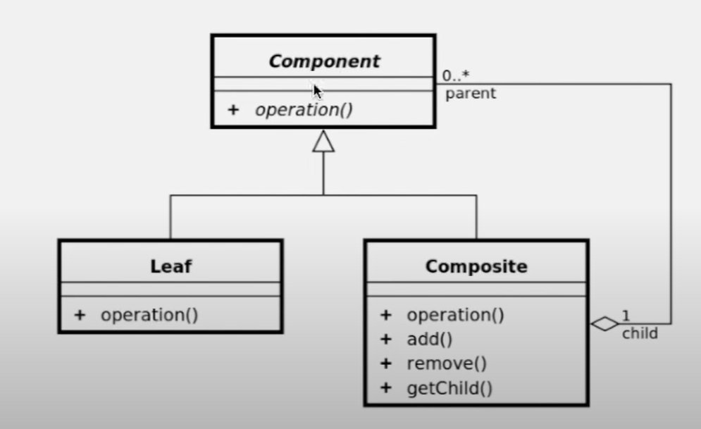

# 12. 컴포짓 패턴

컨테이너와 내용물을 같게 다루기  
  
컴포짓 패턴을 이용해서 트리구조를 구현할 수 있다.  
  
컨테이너(그릇)/내용물(다뤄야할 정보)/동일시  

  
- 그림을 보면 Leaf와 Composite 둘다 Component를 상속하고 있으며 Composite는 Leaf를 내용물로 담게 된다


## 구현
파일 시스템의 트리구조를 흉내내보도록 구현한다.
```java

// Component 추상 클래스의 선언
public abstract class Component {
    private String name;
    
    protected Component(String name) {
       this.name =  name;
    }

    public void setName(String name) {
        this.name = name;
    }

    public String getName() {
        return name;
    }
}

// Component를 상속한 파일클래스
public class File extends Component {
    public File(String name) {
        super(name);
    }

    private Object data;

    public Object getData() {
        return data;
    }

    public void setData(Object data) {
        this.data = data;
    }
}

// Component를 상속한 폴더클래스
public class Folder extends Component {
    
    public Folder(String name) {
        super(name);
    }

    // 폴더의 내용을 담을 수 있다
    List<Component> children = new ArrayList<>();
    
    public boolean addComponent(Component component) {
        return children.add(component);
    }
    
    public boolean removeComponent(Component component) {
        return children.remove(component);
    }

    public List<Component> getChildren() {
        return this.children;
    }
}

//메인
public class Composite_Pattern_Main {
    public static void main(String[] args) {
        Folder
        root = new Folder("root"),
        home= new Folder("home"),
        garam= new Folder("garam"),
        music= new Folder("music"),
        picture= new Folder("picture"),
        doc= new Folder("doc"),
        usr= new Folder("usr");
        
        File 
        track1 = new File("track1"),
        track2 = new File("track2"),
        pic1 = new File("pic1"),
        doc1 = new File("doc1"),
        java = new File("java");
        
        root.addComponent(home);
            home.addComponent(garam);
                garam.addComponent(music);
                    music.addComponent(track1);
                    music.addComponent(track2);
                garam.addComponent(picture);
                    picture.addComponent(pic1);
                garam.addComponent(doc);
                    doc.addComponent(doc1);
                
        root.addComponent(usr);
            usr.addComponent(java);
            show(root);
    }
    
    private static void show(Component component){
        System.out.print("/"+component.getName());
        if(component instanceof Folder){
            for (Component c : ((Folder)component).getChildren()) {
                    show(c);
            }
        }
        
    }
}
```