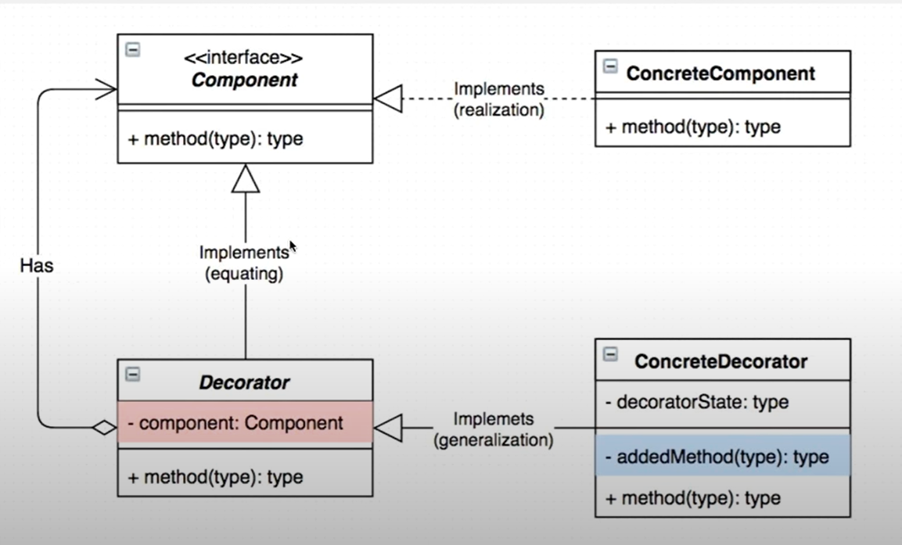
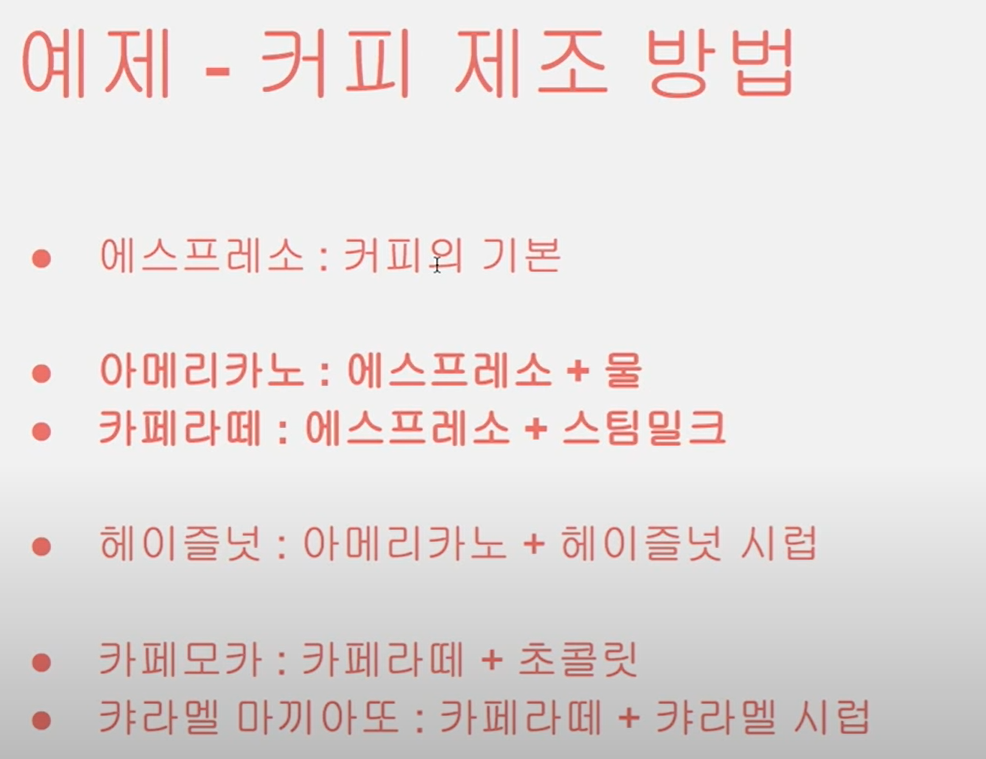
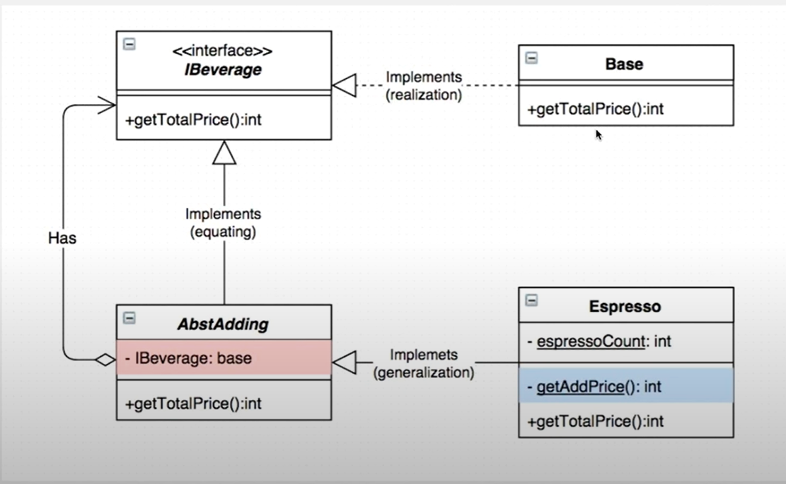

# 13. 데코레이터 패턴

동적으로 책임 추가  
  

  
- Component : 실질적인 인스턴스를 컨트롤하는 역할 
- ConcreteComponent : Component의 실질적인 인스턴스의 부분이며, 책임의 주체의 역할
- Decorator : Component와 ConcreteDecorator를 동일시 하도록 해주는 역할
- ConcreteDecorator를 - 실질적인 장식 인스턴스 및 정의이며 추가된 책임의 주체 부분

## 구현
  
  
```java

// Component 역할을 하는 인터페이스
public interface IBeverage {
    int getTotalPrice();
}

// ConcreteComponent 역할을 하는 클래스
public class Base implements IBeverage {
    @Override
    public int getTotalPrice() {
        return 0;
    }
}

// Decorator 역할을 하는 클래스
public class AbstAdding implements IBeverage {

    private IBeverage base;
    
    public AbstAdding(IBeverage base) {
        this.base = base;
    }
    @Override
    public int getTotalPrice() {
        return base.getTotalPrice();
    }
    public IBeverage getBase() {
        return base;
    }
}

// ConcreteDecorator 역할을 하는 클래스 - 1
public class Espresso extends AbstAdding {
    
    static protected int espressoCount = 0;

    public Espresso(IBeverage base) {
        super(base);
    }

    @Override
    public int getTotalPrice() {
        // 처음 Base가 getTotalPrice가 0이고 처음 샷 추가는 100원
        // 그다음 샷추가시 100 + 70 = 170원으로 됨
        return super.getTotalPrice() + getAddPrice();
    }
    
    private static int getAddPrice() {
        espressoCount += 1;
        int addPrice = 100;
        
        if(espressoCount > 1) {
            addPrice = 70;
        }
        return addPrice;
    }
    @Override
    public IBeverage getBase() {
        return super.getBase();
    }
}

// ConcreteDecorator 역할을 하는 클래스 - 2
public class Milk extends AbstAdding {

    public Milk(IBeverage ingredient) {
        super(ingredient);
    }

    @Override
    public int getTotalPrice() {
        return super.getTotalPrice() + 50;
    }

    @Override
    public IBeverage getBase() {
        return super.getBase();
    }
}

//메인
/**
 * 커피 제조시 에스프레소와 우유를 얼마나 넣느냐에 따라 
 * 가격이 달라짐
 *
 */
public class Decorator_Pattern_Main {

    public static void main(String[] args) {

        Scanner sc = new Scanner(System.in);
        // base
        IBeverage beverage = new Base();
        boolean done = false;
        while (!done) {
            System.out.println("음료 현재 가격 : " + beverage.getTotalPrice());
            System.out.print("선택 : 1:샷 추가 / 2:우유 추가");
            switch (sc.nextInt()) {
            case 0:
                done = true;
                break;
            case 1:
                beverage = new Espresso(beverage);
                break;
            case 2:
                beverage = new Milk(beverage);
                break;
            }
        }

        System.out.println("음료 가격 : " + beverage.getTotalPrice());
        sc.close();
    }

}

```