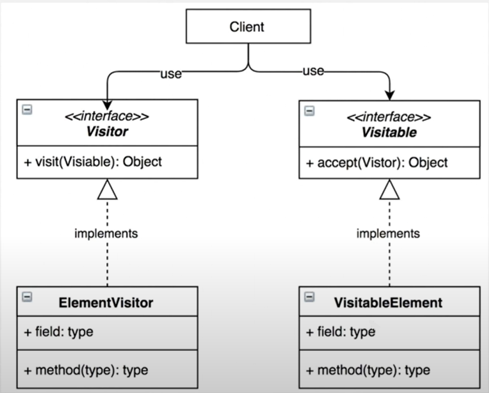

# 14. 방문자 패턴

방문자 패턴을 이용하여 객체에서 처리를 분리해서 사용할 수 있다.  


  
- Client는 Visitor와 Visitable을 둘다 사용하는 상태이다

```java
// Visitor 인터페이스 선언
public interface Visitor {
    public void visit(Visitable visitable);
}

// Visitable인터페이스 선언
public interface Visitable {
    public void accept(Visitor visitor);
}

// ElementVisitor 구현
public class VisitorA implements Visitor {
   
    private int ageSum;
    public VisitorA() {
        ageSum = 0;
    }
    public void visit(Visitable visitable) {
        if (visitable instanceof VisitableA) {
            ageSum += ((VisitableA)visitable).getAge();
        } else {
            //TODO
        }
    }
    public int getAgeSum() {
        return ageSum;
    }

}

// VisitableElement 구현
public class VisitableA implements Visitable {

    private int age;
    
    public VisitableA(int age) {
        this.age = age;
    }

    @Override
    public void accept(Visitor visitor) {
        visitor.visit(this);
    }
    public int getAge() {
        return age;
    }
    public void setAge(int age) {
        this.age = age;
    }
}

// 메인 - Visitable에 접근할때마다 Visitor의 나이가 증가함
public class Visitor_Pattern_Main {

    public static void main(String[] args) {
        ArrayList<Visitable> as = new ArrayList<Visitable>();
        
        as.add(new VisitableA(1));
        as.add(new VisitableA(2));
        as.add(new VisitableA(3));
        as.add(new VisitableA(4));
        as.add(new VisitableA(5));
        
        VisitorA visitor = new VisitorA();
        for (Visitable va : as) {
            va.accept(visitor);
        }
        System.out.println(visitor.getAgeSum());

    }

}

```