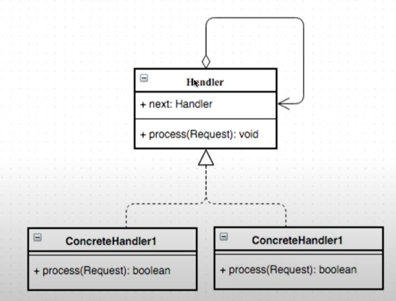

# 15. 책임사슬 패턴 - 1

다양한 처리 방식을 유연하게 연결할 수 있다.  
  
유연한 처리/동적



- Handler 인터페이스를 구현한 클래스를 내부에서 반복적으로 참조하면서 데이터를 처리


## 구현
사칙연산 프로그램
```java
// Handler 역할
public abstract class Calculator {

    private Calculator nextCaculator;

    public void setNextCalculator(Calculator nextCaculator) {
        this.nextCaculator = nextCaculator;
    }

    public boolean process(Request request) {
        if (operator(request)) {
            return true;
        } else {
            return nextCaculator.operator(request);
        }
    }

    abstract protected boolean operator(Request request);
}


// ConcreteHandler - 1
public class PlusCalculator extends Calculator {

    @Override
    protected boolean operator(Request request) {
        if (request.getOperator().equals("+")) {
            int a = request.getA();
            int b = request.getB();
            int result = a + b;
            System.out.println(a + "+" + b + "=" + result);
            return true;
        }
        return false;
    }

}

// ConcreteHandler - 2
public class SubCalculator extends Calculator {

    @Override
    protected boolean operator(Request request) {
        if (request.getOperator().equals("-")) {
            int a = request.getA();
            int b = request.getB();
            int result = a - b;
            System.out.println(a + "-" + b + "=" + result);
            return true;
        }
        return false;
    }

}

// 두개의 피연산자의 연산을 표현한 클래스
public class Request {
    int a, b;
    String operator;
    
    public Request(int a, int b, String operator) {
        this.a = a;
        this.b = b;
        this.operator = operator;
    }
    
    public int getA() {
        return a;
    }
    public void setA(int a) {
        this.a = a;
    }
    public int getB() {
        return b;
    }
    public void setB(int b) {
        this.b = b;
    }
    public String getOperator() {
        return operator;
    }
    public void setOperator(String operator) {
        this.operator = operator;
    }
}

//메인
public class Chain_Of_Responsibility {

    public static void main(String[] args) {
        Calculator plus = new PlusCalculator();
        Calculator sub = new SubCalculator();
        
        plus.setNextCalculator(sub);
        Request request1 = new Request(1,2,"+");
        Request request2 = new Request(10,2,"-");
        
        plus.process(request1);
        sub.process(request2);
    }
}

```