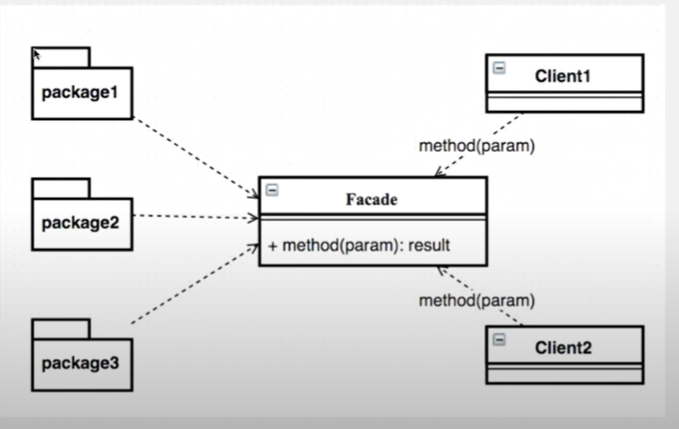

# 17. 퍼사드 패턴

복잡한 과정을 간단하게 제공  





## 구현 

서브시스템의 복잡한 처리 과정 대신 처리
```java
//서브 시스템 1 
class HelpSystem01 {

    public HelpSystem01() {
       System.out.println("Call Constructor : " + getClass().getSimpleName());
    }
    
    public void process() {
        System.out.println("Call Process : " + getClass().getSimpleName());
    }
}

//서브 시스템 2
class HelpSystem02 {
    public HelpSystem02() {
        System.out.println("Call Constructor : " + getClass().getSimpleName());
     }
     
     public void process() {
         System.out.println("Call Process : " + getClass().getSimpleName());
     }
}

//서브 시스템 3
class HelpSystem03 {
    public HelpSystem03() {
        System.out.println("Call Constructor : " + getClass().getSimpleName());
     }
     
     public void process() {
         System.out.println("Call Process : " + getClass().getSimpleName());
     }
}


// 서브 시스템의 복잡한 처리 과정을 대신 처리하는 퍼사드
public class Facade {
    private HelpSystem01 helpSystem01;
    private HelpSystem02 helpSystem02;
    private HelpSystem03 helpSystem03;
    
    public Facade() {
        helpSystem01 = new HelpSystem01();
        helpSystem02 = new HelpSystem02();
        helpSystem03 = new HelpSystem03();
    }
    
    public void process() {
        helpSystem01.process();
        helpSystem02.process();
        helpSystem03.process();
    }
}
```