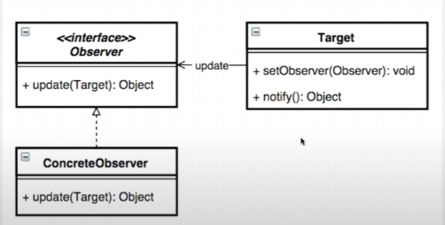

# 19. 옵저버 패턴 - 2

자바에서 기본적으로 제공하는 인터페이스를 이용해서 옵저버 패턴을 구현해 본다.




## 구현
```java
import java.util.Observable;

/**
 * 
 * Observable 상속이기 때문에 확장이 힘듬
 *
 */
public class Button extends Observable {   
    public void click() {
        setChanged();  // 관찰대상이 변경되었을 때 호출
        notifyObservers(); // 옵저버한테 관찰 대상의 상태가 변경되었다는 것을 알림
    }
}

/**
 * JDK에서 제공하는 클래스와 인터페이스를 이용한 옵저버 패턴 구현
 */
public class Observer_Pattern_Main {
    public static void main(String[] args) {
        Button button = new Button();
        button.addObserver((o, arg) -> {
            System.out.println(o + "is Clicked");
        });
        
        button.click();
    }
}

```


