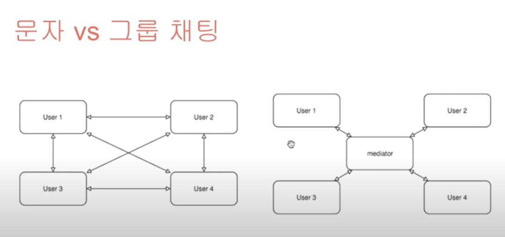
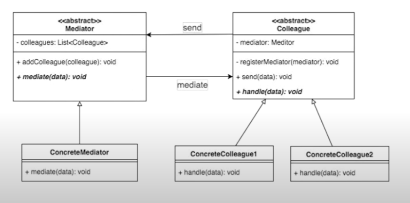

# 21. 중재자 패턴

중재자 패턴을 통해 복잡한 관계를 간단한 관계로 구현한다.  
  
관계, M:N to 1:1  



## 구현
```java
//Mediator 클래스
public abstract class Mediator {
    protected List<Colleague> colleagues = new ArrayList<>();
    
    public boolean addColleague(Colleague colleague) {
        Optional<Colleague> op = Optional.ofNullable(colleague);
        op.orElseThrow(() -> new NullPointerException());
        return colleagues.add(colleague);
    }
    
    abstract protected void mediate(String data);
}

//Colleague 클래스
public abstract class Colleague {
    //어떤 중재자에 속해 있는지...
    Mediator mediator;
    
    //중재자에 합류한다
    public boolean join(Mediator mediator) {
        this.mediator = mediator;
        return this.mediator.addColleague(this);
    }
    // 중재자로 데이터 전달처리
    public void sendData(String data) {
        Optional<String> op = Optional.ofNullable(data);
        op.orElseThrow(() -> new NullPointerException());
        mediator.mediate(data);
    }
    
    // 중재자로 전달받은 데이터 처리
    abstract void handle(String data);
}

//ConcreteMediator 
public class ChatMediator extends Mediator {

    @Override
    protected void mediate(String data) {
        colleagues.stream().forEach((colleague) -> {
            //여러 패턴의 중재 ... 여기서는 간단히 데이터만 보내는 걸로
            colleague.handle(data);
        });
    }

}

//ConcreteColleague
public class ChatColleague extends Colleague {

    @Override
    void handle(String data) {
        System.out.println(this + "-" + data);
    }
}

//메인
public class Mediator_Pattern_Main {
    public static void main(String[] args) {
        Mediator mediator = new ChatMediator();
        
        Colleague colleague1 = new ChatColleague();
        Colleague colleague2 = new ChatColleague();
        Colleague colleague3 = new ChatColleague();
        
        colleague1.join(mediator);
        colleague2.join(mediator);
        colleague3.join(mediator);
        
        colleague1.sendData("AAA");
        colleague2.sendData("BBB");
        colleague3.sendData("CCC");
    }
}
```