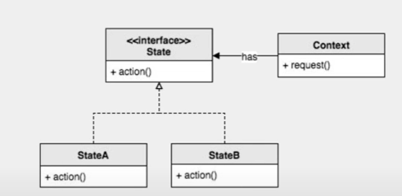

# 22. 상태패턴

상태 패턴을 통해 상태를 객체로 나타내고 행동 구현한다.  



## 구현

```java
// 불이 켜져있는 지 상태를 나타내는 클래스
interface LightState {
    void on();
    void off();
}


public class Light {
    protected LightState lightState;
    
    // 꺼져있는 상태로 초기화
    public Light() {
        lightState = offState;
    }
    
    //꺼져있는 상태면
    private LightState offState = new LightState() {
        @Override
        public void on() {
           //켜져있는 상태로 변환
           System.out.println("Light ON");
           lightState = onState;
        }

        @Override
        public void off() {
            System.out.println("Nothing");
            
        }
    };
    
    //켜져 있는 상태면
    private LightState onState = new LightState() {
        @Override
        public void on() {
           System.out.println("Nothing");
            
        }

        @Override
        public void off() {
            //끄는 상태로 변환
            System.out.println("Light OFF");
            lightState = offState;
            
        }
    };

    
    public void on() {
        lightState.on();
    }
    public void off() {
        lightState.off();
    }
}


//메인

/**
 * 상태 패턴을 통해 상태를 객체로 나타내공 행동을 구현
 * @author USER
 */
class State_Pattern_Main {
    public static void main(String[] args) {
        Light light = new Light();
        
        light.off();
        light.off();
        light.off();
        
        light.on();
        light.on();
        
        light.off();
        light.on();
        light.off();
    }
}

```