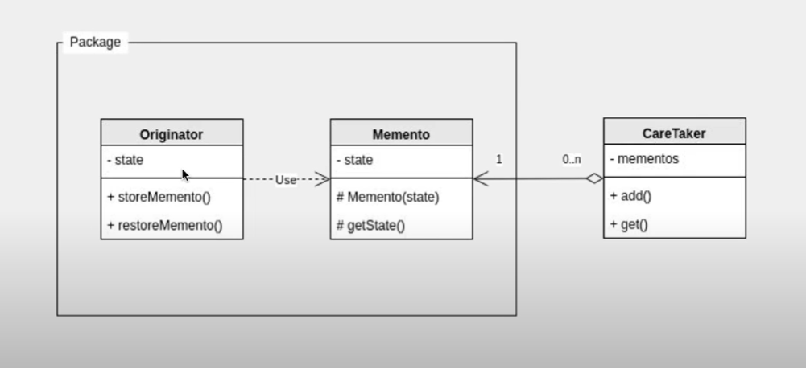

# 23. 메멘토패턴

객체의 상태를 저장하고 이전 상태로 복구한다 접근 제한자 protected의 사용을 이해한다.


- Originator : 프로그래머가 다루는 객체 즉 상태값을 가지고 있는 객체
- Memento : Originator의 상태를 저장하고 있는 객체
- CareTaker : Memento를 캐어해주는 관리자 역할을 한다.

```java
//Originator 객체 생성
public class Originator {

    // 여기서는 객체 보다는 간단한 상태를 문자열로 저장한다.
    String state;
    
    // 메멘토를 생성한다.
    public Memento createMemento() {
        return new Memento(state);
    }
    
    // 메멘토를 복구한다.
    public void restoreMement(Memento memento) {
        //메멘토의 getState()를 이용
        this.state = memento.getState();
    }

    //오리지네이터의 현재 상태 값 확인
    public String getState() {
        return state;
    }

    //오리지네이터의 현재 상태 설정
    public void setState(String state) {
        this.state = state;
    }
}


//Memento 객체
public class Memento {
    String state; //오리지네이터에 저장될 상태
    
    //외부에서 악의적으로 메멘토 생성 제한 protected
    //Originator와 같은 패키지에 두는 이유이다
    protected Memento(String state) {
        this.state = state;
    }
    
    protected String getState() {
        return this.state;
    }
}


//메인이 CareTaker의 역할을 한다.
public class Memento_Pattern_Main {
    public static void main(String[] args) {
        Stack<Memento> mementos = new Stack<>();
        
        Originator originator = new Originator();
        originator.setState("state 1");
        mementos.push(originator.createMemento());
        
        originator.setState("state 2");
        mementos.push(originator.createMemento());
        
        originator.setState("state 3");
        mementos.push(originator.createMemento());
        
        originator.setState("state final");
        mementos.push(originator.createMemento());
        
//        Memento memento = new Memento(); //악의적으로  Memento객체 생성 방지
        originator.restoreMement(mementos.pop());
        System.out.println(originator.getState());
        originator.restoreMement(mementos.pop());
        System.out.println(originator.getState());
        originator.restoreMement(mementos.pop());
        System.out.println(originator.getState());
        originator.restoreMement(mementos.pop());
        System.out.println(originator.getState());
    }
}

```