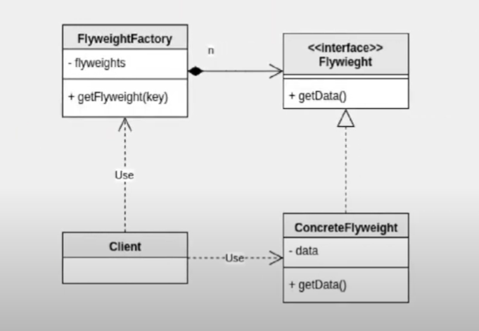

# 24. 플라이웨이트 패턴

플라이웨이트 패턴을 통해 메모리 공간을 절약할 수 있다.  
  
키워드 : 메모리 -> 디비 커넥션 풀 개념 생각



## 구현 
```java
/* 실제 자료 데이터 클래스 */
public class Flyweight {
    private String data;

    public Flyweight(String data) {
        this.data = data;
    }

    public String getData() {
        return data;
    }
}

/* 데이터를 관리하는 팩토리 - 클라이언트가 접근한다. */
public class FlyweightFactory {
    Map<String, Flyweight> pool;

    public FlyweightFactory() {
        pool = new TreeMap<>();
    }
    
    public Flyweight getFlyweight(String key) {
        Optional<Flyweight> opt = Optional.ofNullable(pool.get(key));

        //데이터가 없으면 새로 생성
        Flyweight ret = opt.orElseGet(() -> {
            Flyweight flyweight = new Flyweight(key);
            pool.put(key, flyweight);
            System.out.println("새로 생성 : " + key);
            return pool.get(key);
        });
        
        return ret;
    }
}


/**
 * 메모리를 가볍게 한다 - 풀(Pool)개념..
 * 가져올려는 데이터가 없으면 생성 후 가져오고 있으면 기존의 데이터를 가져옴
 * @author USER
 *
 */
public class Flyweight_Pattern_Main {
    public static void main(String[] args) {
       FlyweightFactory factory = new FlyweightFactory();
       Flyweight flyweight = factory.getFlyweight("A");
       System.out.println(flyweight.getData());
       
       flyweight = factory.getFlyweight("A");
       System.out.println(flyweight.getData());
    }
}

```
