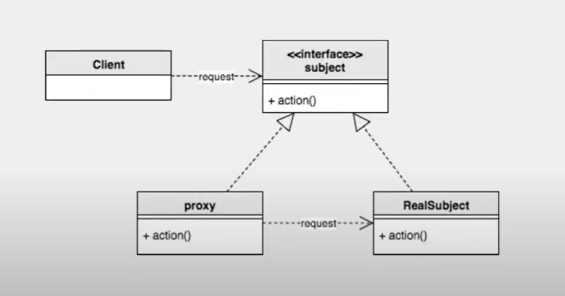

# 25. 프록시 패턴

어떤 로직을 대리해서 처리한다.  
프록시 패턴을 통해 작업을 나눠서 구현할 수 있다.



## 구현

```java
//Subject
public interface Subject {
    
    //리소스가 적게 드는일
    void action1();
    
    //리소스가 많이 드는 일
    void action2();
}


//RealSubject
public class RealSubject implements Subject {

    @Override
    public void action1() {
        System.out.println("간단한 업무 by real");

    }

    @Override
    public void action2() {
        System.out.println("복잡한 업무 by real");

    }
}

//Proxy
public class Proxy implements Subject {

    private Subject real;
    
    public Proxy(Subject real) {
        this.real = real;
    }

    @Override
    public void action1() {
       System.out.println("간단한 업무 by 프록시");
    }

    @Override
    public void action2() {
        this.real.action2();
    }
}

//메인
public class Proxy_Pattern_Main {
    public static void main(String[] args) {

        Subject real = new RealSubject();
        Proxy proxy1 = new Proxy(real);
        Proxy proxy2 = new Proxy(real);
        
        proxy1.action1();
        proxy1.action2();
        
        proxy2.action1();
        proxy2.action2();
    }
}
```